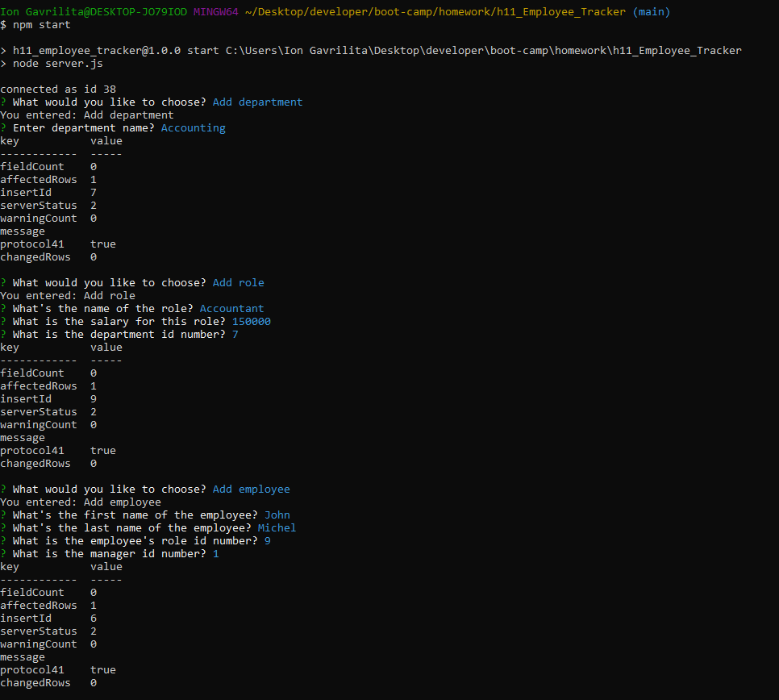
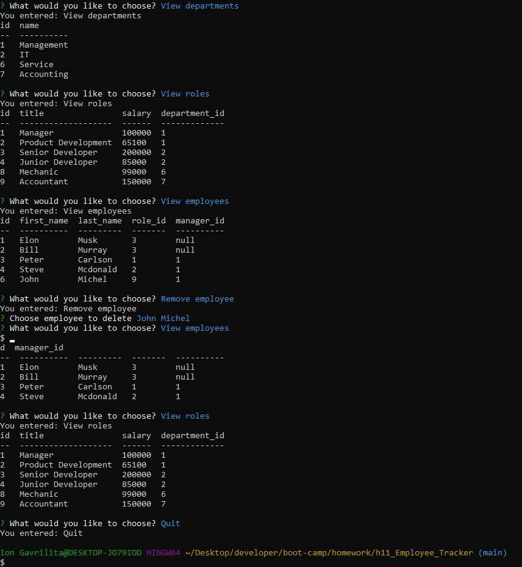
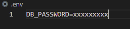

# Employee Tracker
Application can be used to build a solution for managing a company's employees using node, inquirer, and MySQL. This app make it easy to view and interact with information stored in databases. Often these interfaces are known as **C**ontent **M**anagement **S**ystems.

###  Employee Tracker contents:
* [User Story](#User-Story)
* [Images with application functionality](#Images-with-application-functionality)
* [Tech/framework used](#Tech/framework-used)
* [Installation](#Installation)
* [Project Link & Repository](#Project-Link-&-Repository)
* [Contributors](#Contributors)
* [License](#License)

### User Story
```
As a business owner
I want to be able to view and manage the departments, roles, and employees in my company
So that I can organize and plan my business
```
### Images with application functionality:

|  |  |  |

### Tech/framework used:
* Node JS
* Inquirer
* MySQL

### Installation  
* Copy repository on your local machine
* Create a `.gitignore` file and include `node_modules/`, `.DS_Store/`, `.env/` so that your `node_modules` directory and password isn't tracked or uploaded to GitHub. Be sure to create your `.gitignore` file before installing any npm dependencies.
* Run npm install  in your terminal to install all dependency
* Open new terminal window and run: mysql -u root -p. Enter your password to run MySQL
* Add .env file and add your password.
|  |
* Run npm start - to start the app

### Project Link & Repository
- Functionality of the App Youtube Link- (https://www.youtube.com/watch?v=c6s32tKz8jo&feature=youtu.be)
- Repository Link - (https://github.com/IonGavrilita/Employee_Trucker)

### Contributors
- Name: Ion Gavrilita
- Email: gavrilita.ion.93@gmail.com
- Github profile: https://github.com/IonGavrilita
### License
This project is licensed under MIT
[](https://opensource.org/licenses/MIT)
